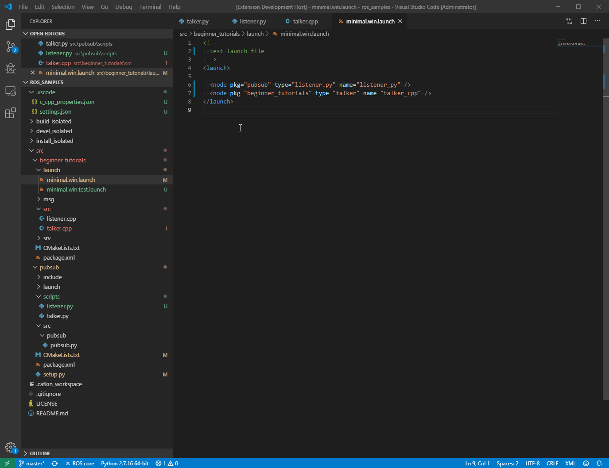
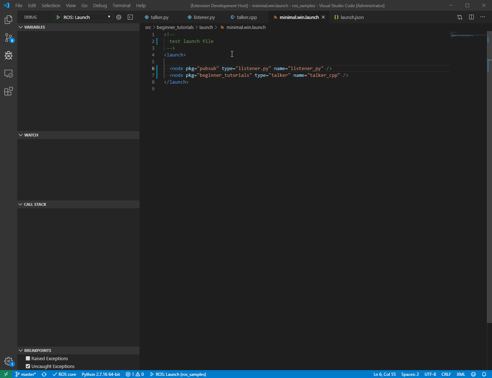

## 一、概述
### 相关扩展

- C/C++
- Python
- CMake
- CMake Tools
- vscode-icons：给不同类型文件设置图标
- ROS

### vscode-ros

vscode-ros是在vscode上用于辅助ros开发的插件，因roboware不再更新所以切换到vscode平台。

- 不会修改工作空间文件目录结构（roboware会改变目录结构，手动创建的无法导入roboware，roboware创建的也无法通过catkin_make手动编译）
- 可以断点调试（测试存在局限性）
- 支持ros2.0
- 提供ros代码对齐（Ctrl+Shift+I选择ros）
- 需要手动修改CMakeList.txt

<!-- more -->

### 官方说明

> ### Getting Started
> The extension will automatically start when you open a catkin workspace. The build system (e.g. catkin_make or catkin build) will automatically be confirmed from the hidden files associated with each system. The ROS distro will automatically be confirmed from the parent environment, or you will be prompted to select a ROS distro if this can’t be done automatically.
> 
>> You must build the catkin workspace at least once before the extension will recognise it.
> 
> To start ROS core, use the “ROS: Start Core” command. The “ROS Core” indicator in the bottom left will show if the core is currently running, and you can click on this to view parameters etc.
> 
> The first time you open the workspace the extension will automatically create build and test tasks and update the C++ and Python paths. You can re-run this process later using the appropriate commands.
> 
> ### Features
> - Automatic ROS environment configuration.
> - Allows starting, stopping and viewing the ROS core status.
> - Automatically discover catkin_make or catkin build build tasks.
> - Create catkin packages using catkin_create_pkg script or catkin create pkg.
> - Run rosrun or roslaunch (breakpoints currently not supported).
> - Syntax highlighting for .msg, .urdf and other ROS files.
> - Automatically add the ROS C++ include and Python import paths.
> - Format C++ using the ROS clang-format style.
> - Preview URDF and Xacro files.
> - Debug a single ROS node (C++ or Python) by attaching to the process.
> - Debug ROS nodes (C++ or Python) launched from a .launch file.

## 二、命令
Ctrl+p打开指令面板，>ros:调用

|Name    |Command    |Description|
| :--- | :--- | :---: |
|Create Catkin Package    |ros.createCatkinPackage    |Create a catkin package. You can right click on a folder in the explorer to create it in a specific location.
|Create Terminal    |ros.createTerminal    |Create a terminal with ROS sourced.
|Show Core Status    |ros.showCoreStatus    |Open a detail view showing ROS core runtime status.
|Start Core    |ros.startCore    |Spawn a ROS core
|Stop Core    |ros.stopCore    |Terminate the ROS core
|Update C++ Properties    |ros.updateCppProperties    |Update the C++ include path to include ROS.
|Update Python Path    |ros.updatePythonPath    |Update the Python path to include ROS.
|Preview URDF    |ros.previewUrdf    |Preview URDF and Xacro files. Updates after changes are saved.

## 三、使用
### 3.1 导入工作空间
1. 创建工作空间
通过makdir -p catkin_ws/src创建工作空间并通过catkin_make编译生成。
1. 加载工作空间
必须先生成编译工作空间。

### 3.2 环境配置
- 代码提示
1. 编译输出信息文件
`catkin_make -DCMAKE_EXPORT_COMPILE_COMMANDS=Yes`
1. 添加信息文件到c_cpp_properties.json文件中（最后5句）
```
{
  "configurations": [
    {
      "browse": {
        "databaseFilename": "${workspaceFolder}/.vscode/browse.vc.db",
        "limitSymbolsToIncludedHeaders": false
      },
      "includePath": [
        "/opt/ros/kinetic/include/**",
        "/home/ros/catkin_ws/src/acr_sdk/include/**",
        "/usr/include/**"
      ],
      "name": "ROS",
      "intelliSenseMode": "gcc-x64",
      "compilerPath": "/usr/bin/gcc",
      "cStandard": "gnu11",
      "cppStandard": "c++14",
      "compileCommands": "${workspaceFolder}/build/compile_commands.json"
    }
  ],
  "version": 4
}
```
**注意**：若无代码提示显示，使用Ctrl+space

- 编译
1. 手动编译
1. 创建task  
 1. Ctrl+Shift+P键入tasks: Configure Task
 ```
  {
    "version": "2.0.0",
    "tasks": [
      {
        "type": "catkin_make",//可以选择shell或者process,如果是shell代码是在shell里面运行一个命令，如果是process代表作为一个进程来运行
        "args": [ //如果需要在命令后面加一些后缀，可以写在这里，比如-DCATKIN_WHITELIST_PACKAGES=“pac1;pac2”
          "--directory",
          "/home/ros/catkin_ws",
          "-DCMAKE_BUILD_TYPE=RelWithDebInfo"
        ],
        "problemMatcher": [
          "$catkin-gcc"
        ],
        "group": "build",
        "label": "catkin_make: build" //代表提示的描述性信息
      }
    ]
  }
 ```
 1. 选择catkin_make:build
 1. Ctrl+Shift+B编译

### 3.3 调试
#### 3.3.1 单程序调试
调试使用attach模式

> Attach toprocess：用于和进程绑定

1. 新建configuration设置

1. 在.vscode的launch.josn添加ROS: Attach
```
{
    "name": "ROS: Attach",
    "request": "attach",
    "type": "ros",
    "MIDebuggerPath": "/usr/bin/gdb"
},
```

1. 编译程序（生成类型必须为RelWithDebInfo）
`SET(CMAKE_BUILD_TYPE "RelWithDebInfo")`

1. 通过>ros::run运行程序（也可以手动运行，需要加载环境）

1. 运行ROS:Attach，选择运行程序进入断点调试模式

- 创建ROS:Attach


- 调试python


调试c++


#### 3.3.2 多程序调试
1. 创建launch文件，调用调试的节点
```
<launch>
    <node pkg = "beginner_tutorials" type = "talker" name="talker_cpp"/>
    <node pkg = "beginner_tutorials" type = "listener" name="listener_cpp"/>
</launch>
```

1. 在.vscode的launch.josn添加ROS: Launch，"target"设置为launch文件的绝对路径
```
{
    "name": "ROS: Launch talker",
    "type": "ros",
    "request": "launch",
    "MIDebuggerPath": "/usr/bin/gdb",
    "target": "/home/ros/catkin_ws/src/talker/launch/acr_node.launch"
}
```

1. 运行ROS:Launch，选择运行程序进入断点调试模式

- 创建ROS:Launch

实际测试时需要手动修改路径，不会有选项出现。



- 启动并检查master


- 调试节点


